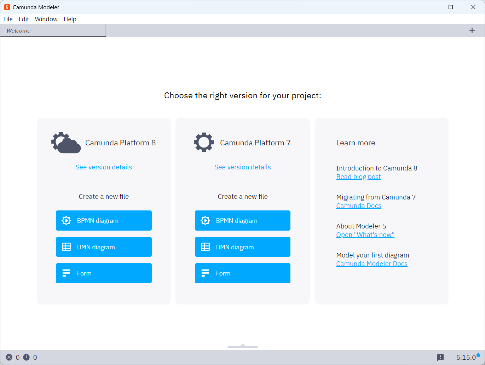

<h1 style="font-size:3.3em;color:skyblue;text-align:center">Activiti学习笔记</h1>


# 工作流

## 概述

工作流(Workflow)，就是通过计算机对业务流程自动化执行管理。它主要解决的是“使在多个参与者之间按照某种预定义的规则自动进行传递文档、信息或任务的过程，从而实现某个预期的业务目标，或者促使此目标的实现”。

工作流概念起源于生产组织和办公自动化领域，是针对日常工作中具有固定程序活动而提出的一个概念，目的是通过将工作分解成定义良好的任务或角色，按照一定的规则和过程来执行这些任务并对其进行监控，达到提高工作效率、更好的控制过程、增强对客户的服务、有效管理业务流程等目的。尽管工作流已经取得了相当的成就，但对工作流的定义还没有能够统一和明确。

一个软件系统中具有工作流的功能，我们把它称为工作流系统，一个系统中工作流的功能是什么？就是对系统的业务流程进行自动化管理，所以工作流是建立在业务流程的基础上，所以一个软件的系统核心根本上还是系统的业务流程，工作流只是协助进行业务流程管理。即使没有工作流业务系统也可以开发运行，只不过有了工作流可以更好的管理业务流程，提高系统的可扩展性。


## 适用行业

消费品行业，制造业，电信服务业，银证险等金融服务业，物流服务业，物业服务业，物业管理，大中型进出口贸易公司，政府事业机构，研究院所及教育服务业等，特别是大的跨国企业和集团公司。


## 应用

* 关键业务流程：订单、报价处理、合同审核、客户电话处理、供应链管理等
* 行政管理类:出差申请、加班申请、请假申请、用车申请、各种办公用品申请、购买申请、日报周报等凡是原来手工流转处理的行政表单
* 人事管理类：员工培训安排、绩效考评、职位变动处理、员工档案信息管理等
* 财务相关类：付款请求、应收款处理、日常报销处理、出差报销、预算和计划申请等
* 客户服务类：客户信息管理、客户投诉、请求处理、售后服务管理等
* 特殊服务类：ISO系列对应流程、质量管理对应流程、产品数据信息管理、贸易公司报关处理、物流公司货物跟踪处理等各种通过表单逐步手工流转完成的任务均可应用工作流软件自动规范地实施


## 实现方式

在没有专门的工作流引擎之前，我们之前为了实现流程控制，通常的做法就是采用状态字段的值来跟踪流程的变化情况。这样不用角色的用户，通过状态字段的取值来决定记录是否显示。

针对有权限可以查看的记录，当前用户根据自己的角色来决定审批是否合格的操作。如果合格将状态字段设置一个值，来代表合格；当然如果不合格也需要设置一个值来代表不合格的情况。

这是一种最为原始的方式。通过状态字段虽然做到了流程控制，但是当我们的流程发生变更的时候，这种方式所编写的代码也要进行调整。

工作流可以做到业务流程变化之后，我们的程序可以不用改变，如果可以实现这样的效果，那么我们的业务系统的适应能力就得到了极大提升。


# Activiti7

## 概述

Activiti是一个工作流引擎， activiti可以将业务系统中复杂的业务流程抽取出来，使用专门的建模语言BPMN2.0进行定义，业务流程按照预先定义的流程进行执行，实现了系统的流程由activiti进行管理，减少业务系统由于流程变更进行系统升级改造的工作量，从而提高系统的健壮性，同时也减少了系统开发维护成本。


### 官网

https://www.activiti.org/


### BPM

BPM（Business Process Management），即业务流程管理，是一种规范化的构造端到端的业务流程，以持续的提高组织业务效率。常见商业管理教育如EMBA、MBA等均将BPM包含在内。


BPM软件就是根据企业中业务环境的变化，推进人与人之间、人与系统之间以及系统与系统之间的整合及调整的经营方法与解决方案的IT工具。

通过BPM软件对企业内部及外部的业务流程的整个生命周期进行建模、自动化、管理监控和优化，使企业成本降低，利润得以大幅提升。

BPM软件在企业中应用领域广泛，凡是有业务流程的地方都可以BPM软件进行管理，比如企业人事办公管理、采购流程管理、公文审批流程管理、财务管理等。


### BPMN

BPMN（Business Process Model AndNotation）- 业务流程模型和符号，是由BPMI（BusinessProcess Management Initiative）开发的一套标准的业务流程建模符号，使用BPMN提供的符号可以创建业务流程。 

BPMN 是目前被各 BPM 厂商广泛接受的 BPM 标准。Activiti 就是使用 BPMN 2.0 进行流程建模、流程执行管理，它包括很多的建模符号，比如：

* Event用一个圆圈表示，它是流程中运行过程中发生的事情

* 活动用圆角矩形表示，一个流程由一个活动或多个活动组成


BPMN图形其实是通过xml表示业务流程

```xml
<?xml version="1.0" encoding="UTF-8"?>
<definitions xmlns="http://www.omg.org/spec/BPMN/20100524/MODEL" xmlns:xsi="http://www.w3.org/2001/XMLSchema-instance" xmlns:xsd="http://www.w3.org/2001/XMLSchema" xmlns:activiti="http://activiti.org/bpmn" xmlns:bpmndi="http://www.omg.org/spec/BPMN/20100524/DI" xmlns:omgdc="http://www.omg.org/spec/DD/20100524/DC" xmlns:omgdi="http://www.omg.org/spec/DD/20100524/DI" typeLanguage="http://www.w3.org/2001/XMLSchema" expressionLanguage="http://www.w3.org/1999/XPath" targetNamespace="http://www.activiti.org/test">
  <process id="myProcess" name="My process" isExecutable="true">
    <startEvent id="startevent1" name="Start"></startEvent>
    <userTask id="usertask1" name="创建请假单"></userTask>
    <sequenceFlow id="flow1" sourceRef="startevent1" targetRef="usertask1"></sequenceFlow>
    <userTask id="usertask2" name="部门经理审核"></userTask>
    <sequenceFlow id="flow2" sourceRef="usertask1" targetRef="usertask2"></sequenceFlow>
    <userTask id="usertask3" name="人事复核"></userTask>
    <sequenceFlow id="flow3" sourceRef="usertask2" targetRef="usertask3"></sequenceFlow>
    <endEvent id="endevent1" name="End"></endEvent>
    <sequenceFlow id="flow4" sourceRef="usertask3" targetRef="endevent1"></sequenceFlow>
  </process>
  <bpmndi:BPMNDiagram id="BPMNDiagram_myProcess">
    <bpmndi:BPMNPlane bpmnElement="myProcess" id="BPMNPlane_myProcess">
      <bpmndi:BPMNShape bpmnElement="startevent1" id="BPMNShape_startevent1">
        <omgdc:Bounds height="35.0" width="35.0" x="130.0" y="160.0"></omgdc:Bounds>
      </bpmndi:BPMNShape>
      <bpmndi:BPMNShape bpmnElement="usertask1" id="BPMNShape_usertask1">
        <omgdc:Bounds height="55.0" width="105.0" x="210.0" y="150.0"></omgdc:Bounds>
      </bpmndi:BPMNShape>
      <bpmndi:BPMNShape bpmnElement="usertask2" id="BPMNShape_usertask2">
        <omgdc:Bounds height="55.0" width="105.0" x="360.0" y="150.0"></omgdc:Bounds>
      </bpmndi:BPMNShape>
      <bpmndi:BPMNShape bpmnElement="usertask3" id="BPMNShape_usertask3">
        <omgdc:Bounds height="55.0" width="105.0" x="510.0" y="150.0"></omgdc:Bounds>
      </bpmndi:BPMNShape>
      <bpmndi:BPMNShape bpmnElement="endevent1" id="BPMNShape_endevent1">
        <omgdc:Bounds height="35.0" width="35.0" x="660.0" y="160.0"></omgdc:Bounds>
      </bpmndi:BPMNShape>
      <bpmndi:BPMNEdge bpmnElement="flow1" id="BPMNEdge_flow1">
        <omgdi:waypoint x="165.0" y="177.0"></omgdi:waypoint>
        <omgdi:waypoint x="210.0" y="177.0"></omgdi:waypoint>
      </bpmndi:BPMNEdge>
      <bpmndi:BPMNEdge bpmnElement="flow2" id="BPMNEdge_flow2">
        <omgdi:waypoint x="315.0" y="177.0"></omgdi:waypoint>
        <omgdi:waypoint x="360.0" y="177.0"></omgdi:waypoint>
      </bpmndi:BPMNEdge>
      <bpmndi:BPMNEdge bpmnElement="flow3" id="BPMNEdge_flow3">
        <omgdi:waypoint x="465.0" y="177.0"></omgdi:waypoint>
        <omgdi:waypoint x="510.0" y="177.0"></omgdi:waypoint>
      </bpmndi:BPMNEdge>
      <bpmndi:BPMNEdge bpmnElement="flow4" id="BPMNEdge_flow4">
        <omgdi:waypoint x="615.0" y="177.0"></omgdi:waypoint>
        <omgdi:waypoint x="660.0" y="177.0"></omgdi:waypoint>
      </bpmndi:BPMNEdge>
    </bpmndi:BPMNPlane>
  </bpmndi:BPMNDiagram>
</definitions>

```


## 使用步骤

1. **部署activiti**：Activiti是一个工作流引擎（其实就是一堆jar包API），业务系统访问(操作)activiti的接口，就可以方便的操作流程相关数据，这样就可以把工作流环境与业务系统的环境集成在一起
2. **流程定义**：使用activiti流程建模工具(activity-designer)定义业务流程(.bpmn文件) 
3. **流程定义部署**：使用activiti提供的api把流程定义内容存储起来，在Activiti执行过程中可以查询定义的内容，Activiti执行把流程定义内容存储在数据库中
4. **启动一个流程实例**：启动一个流程实例表示开始一次业务流程的运行，在员工请假流程定义部署完成后，如果张三要请假就可以启动一个流程实例，如果李四要请假也启动一个流程实例，两个流程的执行互相不影响
5. **用户查询待办任务**：因为现在系统的业务流程已经交给activiti管理，通过activiti就可以查询当前流程执行到哪了，当前用户需要办理什么任务了，这些activiti帮我们管理了，而不需要开发人员自己编写在sql语句查询
6. **用户办理任务**：用户查询待办任务后，就可以办理某个任务，如果这个任务办理完成还需要其它用户办理，比如采购单创建后由部门经理审核，这个过程也是由activiti帮我们完成了
7. **流程结束**：当任务办理完成没有下一个任务结点了，这个流程实例就完成了


# Activiti部署

## 数据库支持

Activiti 在运行时需要数据库的支持，使用25张表，把流程定义节点内容读取到数据库表中，以供后续使用


### 创建数据库

创建  mysql  数据库  activiti

```sql
CREATE DATABASE activiti DEFAULT CHARACTER SET utf8;
```


创建 java项目，目的是使用Java生成数据库表


### 导入maven依赖

导入ProcessEngine所需要的 jar 包

```xml
<?xml version="1.0" encoding="UTF-8"?>
<project xmlns="http://maven.apache.org/POM/4.0.0" xmlns:xsi="http://www.w3.org/2001/XMLSchema-instance"
         xsi:schemaLocation="http://maven.apache.org/POM/4.0.0 https://maven.apache.org/xsd/maven-4.0.0.xsd">
    <modelVersion>4.0.0</modelVersion>
    <parent>
        <groupId>org.springframework.boot</groupId>
        <artifactId>spring-boot-starter-parent</artifactId>
        <version>2.7.1</version>
        <relativePath/> <!-- lookup parent from repository -->
    </parent>
    <groupId>mao</groupId>
    <artifactId>activiti-table-generate</artifactId>
    <version>0.0.1-SNAPSHOT</version>
    <name>activiti-table-generate</name>
    <description>activiti-table-generate</description>
    <properties>
        <java.version>1.8</java.version>
        <activiti.version>7.0.0.Beta1</activiti.version>
    </properties>
    <dependencies>
        <dependency>
            <groupId>org.springframework.boot</groupId>
            <artifactId>spring-boot-starter</artifactId>
        </dependency>

        <dependency>
            <groupId>org.springframework.boot</groupId>
            <artifactId>spring-boot-starter-test</artifactId>
            <scope>test</scope>
        </dependency>

        <dependency>
            <groupId>org.activiti</groupId>
            <artifactId>activiti-engine</artifactId>
            <version>${activiti.version}</version>
        </dependency>
        <dependency>
            <groupId>org.activiti</groupId>
            <artifactId>activiti-spring</artifactId>
            <version>${activiti.version}</version>
        </dependency>
        <!-- bpmn 模型处理 -->
        <dependency>
            <groupId>org.activiti</groupId>
            <artifactId>activiti-bpmn-model</artifactId>
            <version>${activiti.version}</version>
        </dependency>
        <!-- bpmn 转换 -->
        <dependency>
            <groupId>org.activiti</groupId>
            <artifactId>activiti-bpmn-converter</artifactId>
            <version>${activiti.version}</version>
        </dependency>
        <!-- bpmn json数据转换 -->
        <dependency>
            <groupId>org.activiti</groupId>
            <artifactId>activiti-json-converter</artifactId>
            <version>${activiti.version}</version>
        </dependency>
        <!-- bpmn 布局 -->
        <dependency>
            <groupId>org.activiti</groupId>
            <artifactId>activiti-bpmn-layout</artifactId>
            <version>${activiti.version}</version>
        </dependency>
        <!-- activiti 云支持 -->
        <dependency>
            <groupId>org.activiti.cloud</groupId>
            <artifactId>activiti-cloud-services-api</artifactId>
            <version>${activiti.version}</version>
        </dependency>
        <!--mysql依赖 spring-boot-->
        <dependency>
            <groupId>mysql</groupId>
            <artifactId>mysql-connector-java</artifactId>
            <scope>runtime</scope>
        </dependency>
        <!--mybatis依赖-->
        <dependency>
            <groupId>org.mybatis</groupId>
            <artifactId>mybatis</artifactId>
            <version>3.5.9</version>
        </dependency>
        <!-- 链接池 -->
        <dependency>
            <groupId>commons-dbcp</groupId>
            <artifactId>commons-dbcp</artifactId>
            <version>1.4</version>
        </dependency>
    </dependencies>

    <build>
        <plugins>
            <plugin>
                <groupId>org.springframework.boot</groupId>
                <artifactId>spring-boot-maven-plugin</artifactId>
            </plugin>
        </plugins>
    </build>

</project>
```


### 修改核心配置文件

application.yml：

```yaml
# 设置日志级别，root表示根节点，即整体应用日志级别
logging:
  # 日志输出到文件的文件名
  file:
    name: server.log
  # 字符集
  charset:
    file: UTF-8
  # 分文件
  logback:
    rollingpolicy:
      #最大文件大小
      max-file-size: 64KB
      # 文件格式
      file-name-pattern: logs/server_log/%d{yyyy/MM月/dd日/}%i.log
  # 设置日志组
  group:
    # 自定义组名，设置当前组中所包含的包
    mao_pro: mao
  level:
    root: info
    # 为对应组设置日志级别
    mao_pro: debug
    # 日志输出格式
  # pattern:
  # console: "%d %clr(%p) --- [%16t] %clr(%-40.40c){cyan} : %m %n"
```


### 添加activiti配置文件

我们使用activiti提供的默认方式来创建mysql的表

默认方式的要求是在 resources 下创建 activiti.cfg.xml 文件，注意：默认方式目录和文件名不能修改，因为activiti的源码中已经设置，到固定的目录读取固定文件名的文件。

```xml
<?xml version="1.0" encoding="UTF-8"?>
<beans xmlns="http://www.springframework.org/schema/beans"
       xmlns:xsi="http://www.w3.org/2001/XMLSchema-instance"
       xmlns:context="http://www.springframework.org/schema/context"
       xmlns:tx="http://www.springframework.org/schema/tx"
       xsi:schemaLocation="http://www.springframework.org/schema/beans
                    http://www.springframework.org/schema/beans/spring-beans.xsd
http://www.springframework.org/schema/contex
http://www.springframework.org/schema/context/spring-context.xsd
http://www.springframework.org/schema/tx
http://www.springframework.org/schema/tx/spring-tx.xsd">
</beans>
```


### 在activiti.cfg.xml中进行配置

默认方式要在在activiti.cfg.xml中bean的名字叫processEngineConfiguration，名字不可修改

在这里有两种配置方式：

* 单独配置数据源
* 不单独配置数据源


processEngineConfiguration 用来创建 ProcessEngine，在创建 ProcessEngine 时会执行数据库的操作

```xml
<?xml version="1.0" encoding="UTF-8"?>
<beans xmlns="http://www.springframework.org/schema/beans"
       xmlns:xsi="http://www.w3.org/2001/XMLSchema-instance"
       xmlns:context="http://www.springframework.org/schema/context"
       xmlns:tx="http://www.springframework.org/schema/tx"
       xsi:schemaLocation="http://www.springframework.org/schema/beans
                    http://www.springframework.org/schema/beans/spring-beans.xsd
http://www.springframework.org/schema/contex
http://www.springframework.org/schema/context/spring-context.xsd
http://www.springframework.org/schema/tx
http://www.springframework.org/schema/tx/spring-tx.xsd">
    <!-- 默认id对应的值 为processEngineConfiguration -->
    <!-- processEngine Activiti的流程引擎 -->
    <bean id="processEngineConfiguration"
          class="org.activiti.engine.impl.cfg.StandaloneProcessEngineConfiguration">
        <property name="jdbcDriver" value="com.mysql.jdbc.Driver"/>
        <property name="jdbcUrl" value="jdbc:mysql:///activiti"/>
        <property name="jdbcUsername" value="root"/>
        <property name="jdbcPassword" value="123456"/>
        <!-- activiti数据库表处理策略 -->
        <property name="databaseSchemaUpdate" value="true"/>
    </bean>
</beans>
```


或者：

```xml
<?xml version="1.0" encoding="UTF-8"?>
<beans xmlns="http://www.springframework.org/schema/beans"
       xmlns:xsi="http://www.w3.org/2001/XMLSchema-instance"
       xmlns:context="http://www.springframework.org/schema/context"
       xmlns:tx="http://www.springframework.org/schema/tx"
       xsi:schemaLocation="http://www.springframework.org/schema/beans
                    http://www.springframework.org/schema/beans/spring-beans.xsd
http://www.springframework.org/schema/contex
http://www.springframework.org/schema/context/spring-context.xsd
http://www.springframework.org/schema/tx
http://www.springframework.org/schema/tx/spring-tx.xsd">

    <!-- 这里可以使用 链接池 dbcp-->
    <bean id="dataSource" class="org.apache.commons.dbcp.BasicDataSource">
        <property name="driverClassName" value="com.mysql.jdbc.Driver" />
        <property name="url" value="jdbc:mysql:///activiti" />
        <property name="username" value="root" />
        <property name="password" value="123456" />
        <property name="maxActive" value="3" />
        <property name="maxIdle" value="1" />
    </bean>

    <bean id="processEngineConfiguration"
          class="org.activiti.engine.impl.cfg.StandaloneProcessEngineConfiguration">
        <!-- 引用数据源 上面已经设置好了-->
        <property name="dataSource" ref="dataSource" />
        <!-- activiti数据库表处理策略 -->
        <property name="databaseSchemaUpdate" value="true"/>
    </bean>
</beans>
```


这些xml配置也可以在@Configuration配置里编写

```java
package mao.activiti_table_generate.config;

import org.activiti.engine.impl.cfg.StandaloneProcessEngineConfiguration;
import org.apache.commons.dbcp.BasicDataSource;
import org.springframework.beans.factory.annotation.Autowired;
import org.springframework.context.annotation.Bean;
import org.springframework.context.annotation.Configuration;

import javax.sql.DataSource;

/**
 * Project name(项目名称)：activiti-table-generate
 * Package(包名): mao.activiti_table_generate.config
 * Class(类名): ActivitiConfig
 * Author(作者）: mao
 * Author QQ：1296193245
 * GitHub：https://github.com/maomao124/
 * Date(创建日期)： 2023/9/9
 * Time(创建时间)： 20:52
 * Version(版本): 1.0
 * Description(描述)： 无
 */

@Configuration
public class ActivitiConfig
{

    /**
     * Data source data source.
     *
     * @return the data source
     */
    @Bean
    public DataSource dataSource()
    {
        BasicDataSource basicDataSource = new BasicDataSource();
        basicDataSource.setDriverClassName("com.mysql.jdbc.Driver");
        basicDataSource.setUrl("jdbc:mysql:///activiti");
        basicDataSource.setUsername("root");
        basicDataSource.setPassword("123456");
        return basicDataSource;
    }


    /**
     * Activiti配置
     * @param dataSource 数据源
     * @return {@link StandaloneProcessEngineConfiguration}
     */
    @Bean
    public StandaloneProcessEngineConfiguration processEngineConfiguration(@Autowired DataSource dataSource)
    {
        StandaloneProcessEngineConfiguration standaloneProcessEngineConfiguration = new StandaloneProcessEngineConfiguration();
        standaloneProcessEngineConfiguration.setDataSource(dataSource);
        return standaloneProcessEngineConfiguration;
    }
}
```


### 编写程序生成表

调用activiti的工具类，生成acitivti需要的数据库表

直接使用activiti提供的工具类ProcessEngines，会默认读取classpath下的activiti.cfg.xml文件，读取其中的数据库配置，创建 ProcessEngine，在创建ProcessEngine 时会自动创建表，默认的不能使用配置类的形式导入

```java
package mao.activiti_table_generate;

import org.activiti.engine.ProcessEngine;
import org.activiti.engine.ProcessEngines;
import org.slf4j.Logger;
import org.slf4j.LoggerFactory;
import org.springframework.boot.SpringApplication;
import org.springframework.boot.autoconfigure.SpringBootApplication;

@SpringBootApplication
public class ActivitiTableGenerateApplication
{
    private static final Logger log = LoggerFactory.getLogger(ActivitiTableGenerateApplication.class);

    public static void main(String[] args)
    {
        SpringApplication.run(ActivitiTableGenerateApplication.class, args);
        log.info("开始生成");
        //使用classpath下的activiti.cfg.xml中的配置创建processEngine
        ProcessEngine processEngine = ProcessEngines.getDefaultProcessEngine();
        log.debug(processEngine.toString());
        log.info("生成结束");
    }

}
```


### 运行查看结果

```sh
    .   ____          _            __ _ _
   /\\ / ___'_ __ _ _(_)_ __  __ _ \ \ \ \
  ( ( )\___ | '_ | '_| | '_ \/ _` | \ \ \ \
   \\/  ___)| |_)| | | | | || (_| |  ) ) ) )
    '  |____| .__|_| |_|_| |_\__, | / / / /
   =========|_|==============|___/=/_/_/_/
   :: Spring Boot ::                (v2.7.1)

            _____                    _____                   _______
           /\    \                  /\    \                 /::\    \
          /::\____\                /::\    \               /::::\    \
         /::::|   |               /::::\    \             /::::::\    \
        /:::::|   |              /::::::\    \           /::::::::\    \
       /::::::|   |             /:::/\:::\    \         /:::/~~\:::\    \
      /:::/|::|   |            /:::/__\:::\    \       /:::/    \:::\    \
     /:::/ |::|   |           /::::\   \:::\    \     /:::/    / \:::\    \
    /:::/  |::|___|______    /::::::\   \:::\    \   /:::/____/   \:::\____\
   /:::/   |::::::::\    \  /:::/\:::\   \:::\    \ |:::|    |     |:::|    |
  /:::/    |:::::::::\____\/:::/  \:::\   \:::\____\|:::|____|     |:::|    |
  \::/    / ~~~~~/:::/    /\::/    \:::\  /:::/    / \:::\    \   /:::/    /
   \/____/      /:::/    /  \/____/ \:::\/:::/    /   \:::\    \ /:::/    /
               /:::/    /            \::::::/    /     \:::\    /:::/    /
              /:::/    /              \::::/    /       \:::\__/:::/    /
             /:::/    /               /:::/    /         \::::::::/    /
            /:::/    /               /:::/    /           \::::::/    /
           /:::/    /               /:::/    /             \::::/    /
          /:::/    /               /:::/    /               \::/____/
          \::/    /                \::/    /                 ~~
           \/____/                  \/____/
   :: Github (https://github.com/maomao124) ::

2023-09-09 21:11:02.453  INFO 25912 --- [           main] m.a.ActivitiTableGenerateApplication     : Starting ActivitiTableGenerateApplication using Java 1.8.0_332 on mao with PID 25912 (D:\程序\2023Q3\activiti-table-generate\target\classes started by mao in D:\程序\2023Q3\activiti-table-generate)
2023-09-09 21:11:02.454 DEBUG 25912 --- [           main] m.a.ActivitiTableGenerateApplication     : Running with Spring Boot v2.7.1, Spring v5.3.21
2023-09-09 21:11:02.455  INFO 25912 --- [           main] m.a.ActivitiTableGenerateApplication     : No active profile set, falling back to 1 default profile: "default"
2023-09-09 21:11:02.725  INFO 25912 --- [           main] m.a.ActivitiTableGenerateApplication     : Started ActivitiTableGenerateApplication in 0.448 seconds (JVM running for 0.923)
2023-09-09 21:11:02.727  INFO 25912 --- [           main] m.a.ActivitiTableGenerateApplication     : 开始生成
2023-09-09 21:11:02.728  INFO 25912 --- [           main] org.activiti.engine.ProcessEngines       : Initializing process engine using configuration 'file:/D:/%e7%a8%8b%e5%ba%8f/2023Q3/activiti-table-generate/target/classes/activiti.cfg.xml'
2023-09-09 21:11:02.728  INFO 25912 --- [           main] org.activiti.engine.ProcessEngines       : initializing process engine for resource file:/D:/%e7%a8%8b%e5%ba%8f/2023Q3/activiti-table-generate/target/classes/activiti.cfg.xml
Loading class `com.mysql.jdbc.Driver'. This is deprecated. The new driver class is `com.mysql.cj.jdbc.Driver'. The driver is automatically registered via the SPI and manual loading of the driver class is generally unnecessary.
2023-09-09 21:11:03.324  INFO 25912 --- [           main] aultActiviti5CompatibilityHandlerFactory : Activiti 5 compatibility handler implementation not found or error during instantiation : org.activiti.compatibility.DefaultActiviti5CompatibilityHandler. Activiti 5 backwards compatibility disabled.
2023-09-09 21:11:03.349  INFO 25912 --- [           main] o.activiti.engine.impl.db.DbSqlSession   : performing create on engine with resource org/activiti/db/create/activiti.mysql.create.engine.sql
2023-09-09 21:11:03.349  INFO 25912 --- [           main] o.activiti.engine.impl.db.DbSqlSession   : Found MySQL: majorVersion=8 minorVersion=0
2023-09-09 21:11:04.658  INFO 25912 --- [           main] o.activiti.engine.impl.db.DbSqlSession   : performing create on history with resource org/activiti/db/create/activiti.mysql.create.history.sql
2023-09-09 21:11:04.659  INFO 25912 --- [           main] o.activiti.engine.impl.db.DbSqlSession   : Found MySQL: majorVersion=8 minorVersion=0
2023-09-09 21:11:04.905  INFO 25912 --- [           main] o.a.engine.impl.ProcessEngineImpl        : ProcessEngine default created
2023-09-09 21:11:04.915  INFO 25912 --- [           main] org.activiti.engine.ProcessEngines       : initialised process engine default
2023-09-09 21:11:04.915 DEBUG 25912 --- [           main] m.a.ActivitiTableGenerateApplication     : org.activiti.engine.impl.ProcessEngineImpl@5b275174
2023-09-09 21:11:04.915  INFO 25912 --- [           main] m.a.ActivitiTableGenerateApplication     : 生成结束
```


### 查看创建的表

```sh
PS C:\Users\mao\Desktop> mysql -u root -p
Enter password: ********
Welcome to the MySQL monitor.  Commands end with ; or \g.
Your MySQL connection id is 19
Server version: 8.0.32 MySQL Community Server - GPL

Copyright (c) 2000, 2023, Oracle and/or its affiliates.

Oracle is a registered trademark of Oracle Corporation and/or its
affiliates. Other names may be trademarks of their respective
owners.

Type 'help;' or '\h' for help. Type '\c' to clear the current input statement.

mysql> use activiti;
Database changed
mysql> show tables;
+-----------------------+
| Tables_in_activiti    |
+-----------------------+
| act_evt_log           |
| act_ge_bytearray      |
| act_ge_property       |
| act_hi_actinst        |
| act_hi_attachment     |
| act_hi_comment        |
| act_hi_detail         |
| act_hi_identitylink   |
| act_hi_procinst       |
| act_hi_taskinst       |
| act_hi_varinst        |
| act_procdef_info      |
| act_re_deployment     |
| act_re_model          |
| act_re_procdef        |
| act_ru_deadletter_job |
| act_ru_event_subscr   |
| act_ru_execution      |
| act_ru_identitylink   |
| act_ru_integration    |
| act_ru_job            |
| act_ru_suspended_job  |
| act_ru_task           |
| act_ru_timer_job      |
| act_ru_variable       |
+-----------------------+
25 rows in set (0.00 sec)

mysql> show create table  act_evt_log;
+-------------+--------------------------------------------------------------------------------------------------------------------------------------------------------------------------------------------------------------------------------------------------------------------------------------------------------------------------------------------------------------------------------------------------------------------------------------------------------------------------------------------------------------------------------------------------------------------------------------------------------------------------------------------------------------------------------------------------------------------------------------------------------------+
| Table       | Create Table


                             |
+-------------+--------------------------------------------------------------------------------------------------------------------------------------------------------------------------------------------------------------------------------------------------------------------------------------------------------------------------------------------------------------------------------------------------------------------------------------------------------------------------------------------------------------------------------------------------------------------------------------------------------------------------------------------------------------------------------------------------------------------------------------------------------------+
| act_evt_log | CREATE TABLE `act_evt_log` (
  `LOG_NR_` bigint NOT NULL AUTO_INCREMENT,
  `TYPE_` varchar(64) COLLATE utf8mb3_bin DEFAULT NULL,
  `PROC_DEF_ID_` varchar(64) COLLATE utf8mb3_bin DEFAULT NULL,
  `PROC_INST_ID_` varchar(64) COLLATE utf8mb3_bin DEFAULT NULL,
  `EXECUTION_ID_` varchar(64) COLLATE utf8mb3_bin DEFAULT NULL,
  `TASK_ID_` varchar(64) COLLATE utf8mb3_bin DEFAULT NULL,
  `TIME_STAMP_` timestamp(3) NOT NULL,
  `USER_ID_` varchar(255) COLLATE utf8mb3_bin DEFAULT NULL,
  `DATA_` longblob,
  `LOCK_OWNER_` varchar(255) COLLATE utf8mb3_bin DEFAULT NULL,
  `LOCK_TIME_` timestamp(3) NULL DEFAULT NULL,
  `IS_PROCESSED_` tinyint DEFAULT '0',
  PRIMARY KEY (`LOG_NR_`)
) ENGINE=InnoDB DEFAULT CHARSET=utf8mb3 COLLATE=utf8mb3_bin |
+-------------+--------------------------------------------------------------------------------------------------------------------------------------------------------------------------------------------------------------------------------------------------------------------------------------------------------------------------------------------------------------------------------------------------------------------------------------------------------------------------------------------------------------------------------------------------------------------------------------------------------------------------------------------------------------------------------------------------------------------------------------------------------------+
1 row in set (0.00 sec)

mysql>
```


表已经在数据库里创建完成


## 表结构

### 表的命名规则和作用

Activiti 的表都以 act_ 开头

第二部分是表示表的用途的两个字母标识。 用途也和服务的 API 对应


* **ACT_RE** ：'RE'表示 repository。 这个前缀的表包含了流程定义和流程静态资源 （图片，规则，等等）。
* **ACT_RU**：'RU'表示 runtime。 这些运行时的表，包含流程实例，任务，变量，异步任务，等运行中的数据。 Activiti 只在流程实例执行过程中保存这些数据， 在流程结束时就会删除这些记录。 这样运行时表可以一直很小速度很快。
* **ACT_HI**：'HI'表示 history。 这些表包含历史数据，比如历史流程实例， 变量，任务等等。
* **ACT_GE** ： GE 表示 general。 通用数据， 用于不同场景下 


### 数据表介绍

|  **表分类**  |       **表名**        |                      **解释**                      |
| :----------: | :-------------------: | :------------------------------------------------: |
|   一般数据   |                       |                                                    |
|              |  [ACT_GE_BYTEARRAY]   |              通用的流程定义和流程资源              |
|              |   [ACT_GE_PROPERTY]   |                    系统相关属性                    |
| 流程历史记录 |                       |                                                    |
|              |   [ACT_HI_ACTINST]    |                   历史的流程实例                   |
|              |  [ACT_HI_ATTACHMENT]  |                   历史的流程附件                   |
|              |   [ACT_HI_COMMENT]    |                  历史的说明性信息                  |
|              |    [ACT_HI_DETAIL]    |             历史的流程运行中的细节信息             |
|              | [ACT_HI_IDENTITYLINK] |            历史的流程运行过程中用户关系            |
|              |   [ACT_HI_PROCINST]   |                   历史的流程实例                   |
|              |   [ACT_HI_TASKINST]   |                   历史的任务实例                   |
|              |   [ACT_HI_VARINST]    |             历史的流程运行中的变量信息             |
|  流程定义表  |                       |                                                    |
|              |  [ACT_RE_DEPLOYMENT]  |                    部署单元信息                    |
|              |    [ACT_RE_MODEL]     |                      模型信息                      |
|              |   [ACT_RE_PROCDEF]    |                  已部署的流程定义                  |
|  运行实例表  |                       |                                                    |
|              | [ACT_RU_EVENT_SUBSCR] |                     运行时事件                     |
|              |  [ACT_RU_EXECUTION]   |                 运行时流程执行实例                 |
|              | [ACT_RU_IDENTITYLINK] | 运行时用户关系信息，存储任务节点与参与者的相关信息 |
|              |     [ACT_RU_JOB]      |                     运行时作业                     |
|              |     [ACT_RU_TASK]     |                     运行时任务                     |
|              |   [ACT_RU_VARIABLE]   |                    运行时变量表                    |


# Activiti类关系图

## 类关系图


IdentityService，FormService两个Serivce都已经删除了，不是继承关系


## activiti.cfg.xml

activiti的引擎配置文件，包括：ProcessEngineConfiguration的定义、数据源定义、事务管理器等，此文件其实就是一个spring配置文件


## 流程引擎配置类

流程引擎的配置类（ProcessEngineConfiguration），通过ProcessEngineConfiguration可以创建工作流引擎ProceccEngine

常用的实现类如下：

* SpringProcessEngineConfiguration
* StandaloneProcessEngineConfiguration


### StandaloneProcessEngineConfiguration

使用StandaloneProcessEngineConfigurationActiviti可以单独运行，来创建ProcessEngine，Activiti会自己处理事务

通常在activiti.cfg.xml配置文件中定义一个id为 `processEngineConfiguration` 的bean


### SpringProcessEngineConfiguration

通过`org.activiti.spring.SpringProcessEngineConfiguration` 与Spring整合


xml配置示例：

```xml
<beans xmlns="http://www.springframework.org/schema/beans"
    xmlns:xsi="http://www.w3.org/2001/XMLSchema-instance" xmlns:mvc="http://www.springframework.org/schema/mvc"
 xmlns:context="http://www.springframework.org/schema/context"
    xmlns:aop="http://www.springframework.org/schema/aop" xmlns:tx="http://www.springframework.org/schema/tx"
 xsi:schemaLocation="http://www.springframework.org/schema/beans 
       http://www.springframework.org/schema/beans/spring-beans-3.1.xsd 
       http://www.springframework.org/schema/mvc 
       http://www.springframework.org/schema/mvc/spring-mvc-3.1.xsd 
       http://www.springframework.org/schema/context 
        http://www.springframework.org/schema/context/spring-context-3.1.xsd 
       http://www.springframework.org/schema/aop 
       http://www.springframework.org/schema/aop/spring-aop-3.1.xsd 
       http://www.springframework.org/schema/tx 
       http://www.springframework.org/schema/tx/spring-tx-3.1.xsd ">
    <!-- 工作流引擎配置bean -->
    <bean id="processEngineConfiguration" class="org.activiti.spring.SpringProcessEngineConfiguration">
       <!-- 数据源 -->
       <property name="dataSource" ref="dataSource" />
       <!-- 使用spring事务管理器 -->
       <property name="transactionManager" ref="transactionManager" />
       <!-- 数据库策略 -->
       <property name="databaseSchemaUpdate" value="drop-create" />
       <!-- activiti的定时任务关闭 -->
      <property name="jobExecutorActivate" value="false" />
    </bean>
    <!-- 流程引擎 -->
    <bean id="processEngine" class="org.activiti.spring.ProcessEngineFactoryBean">
       <property name="processEngineConfiguration" ref="processEngineConfiguration" />
    </bean>
    <!-- 资源服务service -->
    <bean id="repositoryService" factory-bean="processEngine"
       factory-method="getRepositoryService" />
    <!-- 流程运行service -->
    <bean id="runtimeService" factory-bean="processEngine"
       factory-method="getRuntimeService" />
    <!-- 任务管理service -->
    <bean id="taskService" factory-bean="processEngine"
       factory-method="getTaskService" />
    <!-- 历史管理service -->
    <bean id="historyService" factory-bean="processEngine" factory-method="getHistoryService" />
    <!-- 用户管理service -->
    <bean id="identityService" factory-bean="processEngine" factory-method="getIdentityService" />
    <!-- 引擎管理service -->
    <bean id="managementService" factory-bean="processEngine" factory-method="getManagementService" />
    <!-- 数据源 -->
    <bean id="dataSource" class="org.apache.commons.dbcp.BasicDataSource">
       <property name="driverClassName" value="com.mysql.jdbc.Driver" />
       <property name="url" value="jdbc:mysql://localhost:3306/activiti" />
       <property name="username" value="root" />
       <property name="password" value="mysql" />
       <property name="maxActive" value="3" />
       <property name="maxIdle" value="1" />
    </bean>
    <!-- 事务管理器 -->
    <bean id="transactionManager"
     class="org.springframework.jdbc.datasource.DataSourceTransactionManager">
       <property name="dataSource" ref="dataSource" />
    </bean>
    <!-- 通知 -->
    <tx:advice id="txAdvice" transaction-manager="transactionManager">
       <tx:attributes></tx:attributes>
           <!-- 传播行为 -->
           <tx:method name="save*" propagation="REQUIRED" />
           <tx:method name="insert*" propagation="REQUIRED" />
           <tx:method name="delete*" propagation="REQUIRED" />
           <tx:method name="update*" propagation="REQUIRED" />
           <tx:method name="find*" propagation="SUPPORTS" read-only="true" />
           <tx:method name="get*" propagation="SUPPORTS" read-only="true" />
        </tx:attributes>
    </tx:advice>
    <!-- 切面，根据具体项目修改切点配置 -->
    <aop:config proxy-target-class="true">
       <aop:advisor advice-ref="txAdvice"  pointcut="execution(* 业务包名.service.impl.*.(..))"* />
   </aop:config>
</beans>
```


### 创建processEngineConfiguration

方式一：

```java
ProcessEngineConfiguration configuration = ProcessEngineConfiguration.createProcessEngineConfigurationFromResource("activiti.cfg.xml")
```


上边的代码要求activiti.cfg.xml中必须有一个processEngineConfiguration的bean


方式二：

```java
ProcessEngineConfiguration.createProcessEngineConfigurationFromResource(String resource, String beanName);
```


## 工作流引擎创建

工作流引擎（ProcessEngine），相当于一个门面接口，通过ProcessEngineConfiguration创建processEngine，然后通过ProcessEngine创建各个service接口


### 默认创建方式

将activiti.cfg.xml文件名及路径固定，且activiti.cfg.xml文件中有 processEngineConfiguration的配置

```java
//直接使用工具类 ProcessEngines，使用classpath下的activiti.cfg.xml中的配置创建processEngine
ProcessEngine processEngine = ProcessEngines.getDefaultProcessEngine();
System.out.println(processEngine);
```


### 其它创建方式

```java
//先构建ProcessEngineConfiguration
ProcessEngineConfiguration configuration = ProcessEngineConfiguration.createProcessEngineConfigurationFromResource("activiti.cfg.xml");
//通过ProcessEngineConfiguration创建ProcessEngine，此时会创建数据库
ProcessEngine processEngine = configuration.buildProcessEngine();
```


## Servcie服务接口

Service是工作流引擎提供用于进行工作流部署、执行、管理的服务接口，我们使用这些接口可以就是操作服务对应的数据表


### Service创建方式

通过ProcessEngine创建Service

```java
RuntimeService runtimeService = processEngine.getRuntimeService();
RepositoryService repositoryService = processEngine.getRepositoryService();
TaskService taskService = processEngine.getTaskService();
```


## Service

有如下的Service

|    service名称    |       service作用        |
| :---------------: | :----------------------: |
| RepositoryService |   activiti的资源管理类   |
|  RuntimeService   | activiti的流程运行管理类 |
|    TaskService    |   activiti的任务管理类   |
|  HistoryService   |   activiti的历史管理类   |
|  ManagerService   |   activiti的引擎管理类   |


### RepositoryService

是activiti的资源管理类，提供了管理和控制流程发布包和流程定义的操作。使用工作流建模工具设计的业务流程图需要使用此service将流程定义文件的内容部署到计算机

除了部署流程定义以外还可以查询引擎中的发布包和流程定义

暂停或激活发布包，对应全部和特定流程定义。 暂停意味着它们不能再执行任何操作了，激活是对应的反向操作。获得多种资源，像是包含在发布包里的文件， 或引擎自动生成的流程图。


### RuntimeService

Activiti的流程运行管理类。可以从这个服务类中获取很多关于流程执行相关的信息


### TaskService

Activiti的任务管理类。可以从这个类中获取任务的信息


### HistoryService

Activiti的历史管理类，可以查询历史信息，执行流程时，引擎会保存很多数据（根据配置），比如流程实例启动时间，任务的参与者， 完成任务的时间，每个流程实例的执行路径，等等。 这个服务主要通过查询功能来获得这些数据


### ManagementService

Activiti的引擎管理类，提供了对Activiti流程引擎的管理和维护功能，这些功能不在工作流驱动的应用程序中使用，主要用于Activiti系统的日常维护


# Activiti入门

## 流程

1. 定义流程，按照BPMN的规范，使用流程定义工具，用**流程符号**把整个流程描述出来
2. 部署流程，把画好的流程定义文件，加载到数据库中，生成表的数据
3. 启动流程，使用java代码来操作数据库表中的内容


## 流程符号

### 事件 Event


### 活动 Activity

活动是工作或任务的一个通用术语。一个活动可以是一个任务，还可以是一个当前流程的子处理流程


### 网关 GateWay


#### 排他网关

只有一条路径会被选择。流程执行到该网关时，按照输出流的顺序逐个计算，当条件的计算结果为true时，继续执行当前网关的输出流

如果多条线路计算结果都是 true，则会执行第一个值为 true 的线路。如果所有网关计算结果没有true，则引擎会抛出异常

排他网关需要和条件顺序流结合使用，default 属性指定默认顺序流，当所有的条件不满足时会执行默认顺序流


#### 并行网关

所有路径会被同时选择

并行执行所有输出顺序流，为每一条顺序流创建一个并行执行线路

所有从并行网关拆分并执行完成的线路均在此等候，直到所有的线路都执行完成才继续向下执行


#### 包容网关

可以同时执行多条线路，也可以在网关上设置条件

计算每条线路上的表达式，当表达式计算结果为true时，创建一个并行线路并继续执行

所有从并行网关拆分并执行完成的线路均在此等候，直到所有的线路都执行完成才继续向下执行


#### 事件网关

专门为中间捕获事件设置的，允许设置多个输出流指向多个不同的中间捕获事件。当流程执行到事件网关后，流程处于等待状态，需要等待抛出事件才能将等待状态转换为活动状态


### 流向 Flow

流是连接两个流程节点的连线


## idea插件

Activiti插件actiBPM在新版的idea 2020及以上版本中已经不支持

Activiti BPMN visualizer是一款支持编辑和游览工作流设计图的idea插件，但是它对工作流设计中的网关设计支持并不太友好


## Activiti BPMN visualizer使用示例


在资源路径下创建文件


示例如下：

```xml
<?xml version="1.0" encoding="UTF-8"?>
<definitions xmlns="http://www.omg.org/spec/BPMN/20100524/MODEL" xmlns:xsi="http://www.w3.org/2001/XMLSchema-instance"
             xmlns:xsd="http://www.w3.org/2001/XMLSchema" xmlns:activiti="http://activiti.org/bpmn"
             xmlns:bpmndi="http://www.omg.org/spec/BPMN/20100524/DI"
             xmlns:omgdc="http://www.omg.org/spec/DD/20100524/DC" xmlns:omgdi="http://www.omg.org/spec/DD/20100524/DI"
             typeLanguage="http://www.w3.org/2001/XMLSchema" expressionLanguage="http://www.w3.org/1999/XPath"
             targetNamespace="http://www.activiti.org/processdef">
    <process id="test" name="test" isExecutable="true">
    </process>
    <bpmndi:BPMNDiagram id="BPMNDiagram_test">
        <bpmndi:BPMNPlane bpmnElement="test" id="BPMNPlane_test">
        </bpmndi:BPMNPlane>
    </bpmndi:BPMNDiagram>
</definitions>

```


右键点击


## Camunda Modeler

Camunda Modeler是Camunda官方提供的建模器

是一个流程图的绘图工具。支持三种协议类型流程文件： BPMN diagram、 DMN diagram、Form。


### 下载

https://camunda.com/download/modeler/


### 解压

解压后安装路径必须是非中文路径


解压后的目录如下：


### 运行

双击执行`Camunda Modeler.exe`





### BPMN设计界面


# 流程操作

## 流程定义

流程定义是线下按照bpmn2.0标准去描述业务流程


创建一个比较简单的请假流程


分别指定两个活动的**名称与负责人**。一个流程模板每个工作节点的负责人当然不可能是固定的，所以，在这里我们采用 Activiti 所支持的 **UEL** 表达式，将负责人定义为动态参数

assignee0 和 assignee1


xml文件：

```xml
<?xml version="1.0" encoding="UTF-8"?>
<definitions xmlns="http://www.omg.org/spec/BPMN/20100524/MODEL" xmlns:xsi="http://www.w3.org/2001/XMLSchema-instance" xmlns:xsd="http://www.w3.org/2001/XMLSchema" xmlns:activiti="http://activiti.org/bpmn" xmlns:bpmndi="http://www.omg.org/spec/BPMN/20100524/DI" xmlns:omgdc="http://www.omg.org/spec/DD/20100524/DC" xmlns:omgdi="http://www.omg.org/spec/DD/20100524/DI" typeLanguage="http://www.w3.org/2001/XMLSchema" expressionLanguage="http://www.w3.org/1999/XPath" targetNamespace="http://www.activiti.org/processdef">
  <process id="test" name="test" isExecutable="true">
    <startEvent id="sid-c3b15a5f-fe70-4fe1-af9a-edf7b415c0ee" name="请假流程定义"/>
    <userTask id="sid-32a2b9d4-6749-4d6b-aedb-2fac3815170c" name="创建申请" activiti:assignee="${assignee0}"/>
    <userTask id="sid-b602704c-cae7-4346-bab2-07f7831ba0e8" name="审批申请" activiti:assignee="${assignee1}"/>
    <sequenceFlow id="sid-a6d8056e-3823-4e0b-beb4-1dde11a497c8" sourceRef="sid-32a2b9d4-6749-4d6b-aedb-2fac3815170c" targetRef="sid-b602704c-cae7-4346-bab2-07f7831ba0e8"/>
    <endEvent id="sid-c82edc5e-3028-4d2e-bcbc-d780ece87d6f" name="结束"/>
    <sequenceFlow id="sid-fac53945-3036-4db7-9c73-da1631eb6cf9" sourceRef="sid-b602704c-cae7-4346-bab2-07f7831ba0e8" targetRef="sid-c82edc5e-3028-4d2e-bcbc-d780ece87d6f"/>
    <sequenceFlow id="sid-8930ce5c-ba7d-4f48-a4a0-113ff80fca96" sourceRef="sid-c3b15a5f-fe70-4fe1-af9a-edf7b415c0ee" targetRef="sid-32a2b9d4-6749-4d6b-aedb-2fac3815170c"/>
  </process>
  <bpmndi:BPMNDiagram id="BPMNDiagram_test">
    <bpmndi:BPMNPlane bpmnElement="test" id="BPMNPlane_test">
      <bpmndi:BPMNShape id="shape-643471ce-5aaf-4ce9-9654-0f9b552705b4" bpmnElement="sid-c3b15a5f-fe70-4fe1-af9a-edf7b415c0ee">
        <omgdc:Bounds x="-1823.05" y="-3102.7" width="30.0" height="30.0"/>
      </bpmndi:BPMNShape>
      <bpmndi:BPMNShape id="shape-659cf6cb-a545-4b63-925d-4cad5523a1dc" bpmnElement="sid-32a2b9d4-6749-4d6b-aedb-2fac3815170c">
        <omgdc:Bounds x="-1858.05" y="-3047.7" width="100.0" height="80.0"/>
      </bpmndi:BPMNShape>
      <bpmndi:BPMNShape id="shape-279309f5-d8fa-4951-88e1-20c98857ea5b" bpmnElement="sid-b602704c-cae7-4346-bab2-07f7831ba0e8">
        <omgdc:Bounds x="-1858.05" y="-2936.0425" width="100.0" height="80.0"/>
      </bpmndi:BPMNShape>
      <bpmndi:BPMNEdge id="edge-f434e240-3d5e-4c2f-9f6c-2544d81f831e" bpmnElement="sid-a6d8056e-3823-4e0b-beb4-1dde11a497c8">
        <omgdi:waypoint x="-1808.05" y="-2967.7"/>
        <omgdi:waypoint x="-1808.05" y="-2936.0425"/>
      </bpmndi:BPMNEdge>
      <bpmndi:BPMNShape id="shape-f0874fe4-9331-4915-9b96-c436412231dc" bpmnElement="sid-c82edc5e-3028-4d2e-bcbc-d780ece87d6f">
        <omgdc:Bounds x="-1713.05" y="-2903.2" width="30.0" height="30.0"/>
      </bpmndi:BPMNShape>
      <bpmndi:BPMNEdge id="edge-b8629684-33cd-4007-b782-b6403dc5034b" bpmnElement="sid-fac53945-3036-4db7-9c73-da1631eb6cf9">
        <omgdi:waypoint x="-1758.05" y="-2896.0425"/>
        <omgdi:waypoint x="-1713.05" y="-2888.2"/>
      </bpmndi:BPMNEdge>
      <bpmndi:BPMNEdge id="edge-3144cad3-fff8-4390-a9d6-f1ffdce61cde" bpmnElement="sid-8930ce5c-ba7d-4f48-a4a0-113ff80fca96">
        <omgdi:waypoint x="-1808.05" y="-3072.7"/>
        <omgdi:waypoint x="-1808.05" y="-3047.7"/>
      </bpmndi:BPMNEdge>
    </bpmndi:BPMNPlane>
  </bpmndi:BPMNDiagram>
</definitions>

```


## 流程定义部署

将上面在设计器中定义的流程部署到activiti数据库中，就是流程定义部署


```java
package mao.activiti_process_deploy;

import org.activiti.engine.ProcessEngine;
import org.activiti.engine.ProcessEngines;
import org.activiti.engine.RepositoryService;
import org.activiti.engine.repository.Deployment;
import org.slf4j.Logger;
import org.slf4j.LoggerFactory;
import org.springframework.boot.SpringApplication;
import org.springframework.boot.autoconfigure.SpringBootApplication;


@SpringBootApplication
public class ActivitiProcessDeployApplication
{
    private static final Logger log = LoggerFactory.getLogger(ActivitiProcessDeployApplication.class);

    public static void main(String[] args)
    {
        SpringApplication.run(ActivitiProcessDeployApplication.class, args);
        ProcessEngine processEngine = ProcessEngines.getDefaultProcessEngine();
        RepositoryService repositoryService = processEngine.getRepositoryService();
        Deployment deployment = repositoryService.createDeployment()
                .name("请假流程定义")
                .addClasspathResource("test.bpmn20.xml")
                .deploy();
        log.info("流程id：" + deployment.getId());
        log.info("流程名称：" + deployment.getName());
    }

}
```


也可以直接加载压缩包

```java
// 定义zip输入流
		InputStream inputStream = this
				.getClass()
				.getClassLoader()
				.getResourceAsStream(
						"bpmn/evection.zip");
		ZipInputStream zipInputStream = new ZipInputStream(inputStream);
		// 获取repositoryService
		RepositoryService repositoryService = processEngine
				.getRepositoryService();
		// 流程部署
		Deployment deployment = repositoryService.createDeployment()
				.addZipInputStream(zipInputStream)
				.deploy();
```


运行程序：

```sh
2023-09-19 11:03:50.027  INFO 13952 --- [           main] aultActiviti5CompatibilityHandlerFactory : Activiti 5 compatibility handler implementation not found or error during instantiation : org.activiti.compatibility.DefaultActiviti5CompatibilityHandler. Activiti 5 backwards compatibility disabled.
2023-09-19 11:03:50.050  INFO 13952 --- [           main] o.a.engine.impl.ProcessEngineImpl        : ProcessEngine default created
2023-09-19 11:03:50.052  INFO 13952 --- [           main] org.activiti.engine.ProcessEngines       : initialised process engine default
2023-09-19 11:03:50.142  INFO 13952 --- [           main] m.a.ActivitiProcessDeployApplication     : 流程id：2501
2023-09-19 11:03:50.142  INFO 13952 --- [           main] m.a.ActivitiProcessDeployApplication     : 流程名称：请假流程定义
```


## 操作的数据表

流程定义部署后操作activiti的3张表如下：

* **act_re_deployment**：流程定义部署表，每部署一次增加一条记录
* **act_re_procdef**：流程定义表，部署每个新的流程定义都会在这张表中增加一条记录
* **act_ge_bytearray**：流程资源表 


看看写入了什么数据：

```sql
select * from act_re_deployment;
```


```sql
select * from act_re_procdef;
```


```sql
select * from act_ge_bytearray;
```


```sh
mysql> use activiti;
Database changed
mysql> select * from act_re_deployment;
+------+--------------+-----------+------+------------+-------------------------+-----------------+
| ID_  | NAME_        | CATEGORY_ | KEY_ | TENANT_ID_ | DEPLOY_TIME_            | ENGINE_VERSION_ |
+------+--------------+-----------+------+------------+-------------------------+-----------------+
| 2501 | 请假流程定义 | NULL      | NULL |            | 2023-09-19 11:03:50.054 | NULL            |
+------+--------------+-----------+------+------------+-------------------------+-----------------+
1 row in set (0.00 sec)

mysql> select * from act_re_procdef;
+-------------+------+------------------------------------+-------+------+----------+----------------+-----------------+---------------------+--------------+---------------------+-------------------------+-------------------+------------+-----------------+
| ID_         | REV_ | CATEGORY_                          | NAME_ | KEY_ | VERSION_ | DEPLOYMENT_ID_ | RESOURCE_NAME_  | DGRM_RESOURCE_NAME_ | DESCRIPTION_ | HAS_START_FORM_KEY_ | HAS_GRAPHICAL_NOTATION_ | SUSPENSION_STATE_ | TENANT_ID_ | ENGINE_VERSION_ |
+-------------+------+------------------------------------+-------+------+----------+----------------+-----------------+---------------------+--------------+---------------------+-------------------------+-------------------+------------+-----------------+
| test:1:2503 |    1 | http://www.activiti.org/processdef | test  | test |        1 | 2501           | test.bpmn20.xml | NULL                | NULL         |                   0 |                       1 |                 1 |            | NULL            |
+-------------+------+------------------------------------+-------+------+----------+----------------+-----------------+---------------------+--------------+---------------------+-------------------------+-------------------+------------+-----------------+
1 row in set (0.00 sec)

mysql> select * from act_ge_bytearray;
```

```sh
mysql> select * from act_ge_bytearray\G;
*************************** 1. row ***************************
           ID_: 2502
          REV_: 1
         NAME_: test.bpmn20.xml
DEPLOYMENT_ID_: 2501
        BYTES_: 0x3C3F786D6C2076657273696F6E3D22312E302220656E636F64696E673D225554462D38223F3E0D0A3C646566696E6974696F6E7320786D6C6E733D22687474703A2F2F7777772E6F6D672E6F72672F737065632F42504D4E2F32303130303532342F4D4F44454C2220786D6C6E733A7873693D22687474703A2F2F7777772E77332E6F72672F323030312F584D4C536368656D612D696E7374616E63652220786D6C6E733A7873643D22687474703A2F2F7777772E77332E6F72672F323030312F584D4C536368656D612220786D6C6E733A61637469766974693D22687474703A2F2F61637469766974692E6F72672F62706D6E2220786D6C6E733A62706D6E64693D22687474703A2F2F7777772E6F6D672E6F72672F737065632F42504D4E2F32303130303532342F44492220786D6C6E733A6F6D6764633D22687474703A2F2F7777772E6F6D672E6F72672F737065632F44442F32303130303532342F44432220786D6C6E733A6F6D6764693D22687474703A2F2F7777772E6F6D672E6F72672F737065632F44442F32303130303532342F44492220747970654C616E67756167653D22687474703A2F2F7777772E77332E6F72672F323030312F584D4C536368656D61222065787072657373696F6E4C616E67756167653D22687474703A2F2F7777772E77332E6F72672F313939392F585061746822207461726765744E616D6573706163653D22687474703A2F2F7777772E61637469766974692E6F72672F70726F63657373646566223E0D0A20203C70726F636573732069643D227465737422206E616D653D22746573742220697345786563757461626C653D2274727565223E0D0A202020203C73746172744576656E742069643D227369642D63336231356135662D666537302D346665312D616639612D65646637623431356330656522206E616D653D22E8AFB7E58187E6B581E7A88BE5AE9AE4B989222F3E0D0A202020203C757365725461736B2069643D227369642D33326132623964342D363734392D346436622D616564622D32666163333831353137306322206E616D653D22E5889BE5BBBAE794B3E8AFB7222061637469766974693A61737369676E65653D22247B61737369676E6565307D222F3E0D0A202020203C757365725461736B2069643D227369642D62363032373034632D636165372D343334362D626162322D30376637383331626130653822206E616D653D22E5AEA1E689B9E794B3E8AFB7222061637469766974693A61737369676E65653D22247B61737369676E6565317D222F3E0D0A202020203C73657175656E6365466C6F772069643D227369642D61366438303536652D333832332D346530622D626562342D3164646531316134393763382220736F757263655265663D227369642D33326132623964342D363734392D346436622D616564622D32666163333831353137306322207461726765745265663D227369642D62363032373034632D636165372D343334362D626162322D303766373833316261306538222F3E0D0A202020203C656E644576656E742069643D227369642D63383265646335652D333032382D346432652D626362632D64373830656365383764366622206E616D653D22E7BB93E69D9F222F3E0D0A202020203C73657175656E6365466C6F772069643D227369642D66616335333934352D333033362D346462372D396337332D6461313633316562366366392220736F757263655265663D227369642D62363032373034632D636165372D343334362D626162322D30376637383331626130653822207461726765745265663D227369642D63383265646335652D333032382D346432652D626362632D643738306563653837643666222F3E0D0A202020203C73657175656E6365466C6F772069643D227369642D38393330636535632D626137642D346634382D613461302D3131336666383066636139362220736F757263655265663D227369642D63336231356135662D666537302D346665312D616639612D65646637623431356330656522207461726765745265663D227369642D33326132623964342D363734392D346436622D616564622D326661633338313531373063222F3E0D0A20203C2F70726F636573733E0D0A20203C62706D6E64693A42504D4E4469616772616D2069643D2242504D4E4469616772616D5F74657374223E0D0A202020203C62706D6E64693A42504D4E506C616E652062706D6E456C656D656E743D2274657374222069643D2242504D4E506C616E655F74657374223E0D0A2020202020203C62706D6E64693A42504D4E53686170652069643D2273686170652D36343334373163652D356161662D346365392D393635342D306639623535323730356234222062706D6E456C656D656E743D227369642D63336231356135662D666537302D346665312D616639612D656466376234313563306565223E0D0A20202020202020203C6F6D6764633A426F756E647320783D222D313832332E30352220793D222D333130322E37222077696474683D2233302E3022206865696768743D2233302E30222F3E0D0A2020202020203C2F62706D6E64693A42504D4E53686170653E0D0A2020202020203C62706D6E64693A42504D4E53686170652069643D2273686170652D36353963663663622D613534352D346236332D393235642D346361643535323361316463222062706D6E456C656D656E743D227369642D33326132623964342D363734392D346436622D616564622D326661633338313531373063223E0D0A20202020202020203C6F6D6764633A426F756E647320783D222D313835382E30352220793D222D333034372E37222077696474683D223130302E3022206865696768743D2238302E30222F3E0D0A2020202020203C2F62706D6E64693A42504D4E53686170653E0D0A2020202020203C62706D6E64693A42504D4E53686170652069643D2273686170652D32373933303966352D643866612D343935312D383865312D323063393838353765613562222062706D6E456C656D656E743D227369642D62363032373034632D636165372D343334362D626162322D303766373833316261306538223E0D0A20202020202020203C6F6D6764633A426F756E647320783D222D313835382E30352220793D222D323933362E30343235222077696474683D223130302E3022206865696768743D2238302E30222F3E0D0A2020202020203C2F62706D6E64693A42504D4E53686170653E0D0A2020202020203C62706D6E64693A42504D4E456467652069643D22656467652D66343334653234302D336435652D346332662D396636632D323534346438316638333165222062706D6E456C656D656E743D227369642D61366438303536652D333832332D346530622D626562342D316464653131613439376338223E0D0A20202020202020203C6F6D6764693A776179706F696E7420783D222D313830382E30352220793D222D323936372E37222F3E0D0A20202020202020203C6F6D6764693A776179706F696E7420783D222D313830382E30352220793D222D323933362E30343235222F3E0D0A2020202020203C2F62706D6E64693A42504D4E456467653E0D0A2020202020203C62706D6E64693A42504D4E53686170652069643D2273686170652D66303837346665342D393333312D343931352D396239362D633433363431323233316463222062706D6E456C656D656E743D227369642D63383265646335652D333032382D346432652D626362632D643738306563653837643666223E0D0A20202020202020203C6F6D6764633A426F756E647320783D222D313731332E30352220793D222D323930332E32222077696474683D2233302E3022206865696768743D2233302E30222F3E0D0A2020202020203C2F62706D6E64693A42504D4E53686170653E0D0A2020202020203C62706D6E64693A42504D4E456467652069643D22656467652D62383632393638342D333363642D343030372D623738322D623634303364633530333462222062706D6E456C656D656E743D227369642D66616335333934352D333033362D346462372D396337332D646131363331656236636639223E0D0A20202020202020203C6F6D6764693A776179706F696E7420783D222D313735382E30352220793D222D323839362E30343235222F3E0D0A20202020202020203C6F6D6764693A776179706F696E7420783D222D313731332E30352220793D222D323838382E32222F3E0D0A2020202020203C2F62706D6E64693A42504D4E456467653E0D0A2020202020203C62706D6E64693A42504D4E456467652069643D22656467652D33313434636164332D666666382D343339302D613964362D663166666463653631636465222062706D6E456C656D656E743D227369642D38393330636535632D626137642D346634382D613461302D313133666638306663613936223E0D0A20202020202020203C6F6D6764693A776179706F696E7420783D222D313830382E30352220793D222D333037322E37222F3E0D0A20202020202020203C6F6D6764693A776179706F696E7420783D222D313830382E30352220793D222D333034372E37222F3E0D0A2020202020203C2F62706D6E64693A42504D4E456467653E0D0A202020203C2F62706D6E64693A42504D4E506C616E653E0D0A20203C2F62706D6E64693A42504D4E4469616772616D3E0D0A3C2F646566696E6974696F6E733E0D0A
    GENERATED_: 0
1 row in set (0.00 sec)
```


`act_re_deployment`和`act_re_procdef`一对多关系，一次部署在流程部署表生成一条记录，但一次部署可以部署多个流程定义，每个流程定义在流程定义表生成一条记录


## 启动流程实例

流程定义部署在activiti后就可以通过工作流管理业务流程了

针对该流程，启动一个流程表示发起一个新的请假申请单，这就相当于java类与java对象的关系，类定义好后需要new创建一个对象使用


```java
package mao.activiti_process_deploy;

import org.activiti.engine.ProcessEngine;
import org.activiti.engine.ProcessEngines;
import org.activiti.engine.RuntimeService;
import org.activiti.engine.runtime.ProcessInstance;
import org.junit.jupiter.api.Test;
import org.slf4j.Logger;
import org.slf4j.LoggerFactory;
import org.springframework.boot.test.context.SpringBootTest;

import java.util.HashMap;
import java.util.Map;

@SpringBootTest
class ActivitiProcessDeployApplicationTests
{
    private static final Logger log = LoggerFactory.getLogger(ActivitiProcessDeployApplicationTests.class);

    @Test
    void testStartProcess()
    {
        ProcessEngine processEngine = ProcessEngines.getDefaultProcessEngine();
        RuntimeService runtimeService = processEngine.getRuntimeService();
        Map<String, Object> map = new HashMap<>();
        map.put("assignee0", "张三");
        map.put("assignee1", "王经理");
        ProcessInstance instance = runtimeService.startProcessInstanceByKey("test", map);
        log.info("流程定义id:" + instance.getProcessDefinitionId());
        log.info("流程实例 id:" + instance.getId());
        log.info("当前活动的id:" + instance.getActivityId());
    }

}

```


启动流程时，分别指定各个任务的**负责人，**上述代码表示该请假流程是由**张三**发起的，审批人是**王经理**

其中参数 **key** 表示指定所启动的流程定义，而 **map** 则是为其启动之后的流程实例赋值


key位于xml文件里


运行：

```sh
2023-09-19 11:23:29.648  INFO 27400 --- [           main] .a.ActivitiProcessDeployApplicationTests : 流程定义id:test:1:2503
2023-09-19 11:23:29.648  INFO 27400 --- [           main] .a.ActivitiProcessDeployApplicationTests : 流程实例 id:5001
2023-09-19 11:23:29.648  INFO 27400 --- [           main] .a.ActivitiProcessDeployApplicationTests : 当前活动的id:null
```


## 操作的数据表

启动流程实例操作的数据表如下：

* **act_hi_actinst**：流程实例执行历史
* **act_hi_identitylink**：流程的参与用户历史信息
* **act_hi_procinst**：流程实例历史信息
* **act_hi_taskinst**：流程任务历史信息
* **act_ru_execution**：流程执行信息
* **act_ru_identitylink**：流程的参与用户信息
* **act_ru_task**：任务信息


```sql
select * from act_hi_actinst;
select * from act_hi_identitylink;
select * from act_hi_procinst;
select * from act_hi_taskinst;
select * from act_ru_execution;
select * from act_ru_identitylink;
select * from act_ru_task;
```


```sh
mysql> select * from act_hi_actinst;
+------+--------------+---------------+---------------+------------------------------------------+----------+--------------------+--------------+------------+-----------+-------------------------+-------------------------+-----------+----------------+------------+
| ID_  | PROC_DEF_ID_ | PROC_INST_ID_ | EXECUTION_ID_ | ACT_ID_                                  | TASK_ID_ | CALL_PROC_INST_ID_ | ACT_NAME_    | ACT_TYPE_  | ASSIGNEE_ | START_TIME_             | END_TIME_               | DURATION_ | DELETE_REASON_ | TENANT_ID_ |
+------+--------------+---------------+---------------+------------------------------------------+----------+--------------------+--------------+------------+-----------+-------------------------+-------------------------+-----------+----------------+------------+
| 5005 | test:1:2503  | 5001          | 5004          | sid-c3b15a5f-fe70-4fe1-af9a-edf7b415c0ee | NULL     | NULL               | 请假流程定义 | startEvent | NULL      | 2023-09-19 11:23:29.585 | 2023-09-19 11:23:29.586 |         1 | NULL           |            |
| 5006 | test:1:2503  | 5001          | 5004          | sid-32a2b9d4-6749-4d6b-aedb-2fac3815170c | 5007     | NULL               | 创建申请     | userTask   | 张三      | 2023-09-19 11:23:29.586 | NULL                    |      NULL | NULL           |            |
+------+--------------+---------------+---------------+------------------------------------------+----------+--------------------+--------------+------------+-----------+-------------------------+-------------------------+-----------+----------------+------------+
2 rows in set (0.00 sec)

mysql> select * from act_hi_identitylink;
+------+-----------+-------------+----------+----------+---------------+
| ID_  | GROUP_ID_ | TYPE_       | USER_ID_ | TASK_ID_ | PROC_INST_ID_ |
+------+-----------+-------------+----------+----------+---------------+
| 5008 | NULL      | participant | 张三     | NULL     | 5001          |
+------+-----------+-------------+----------+----------+---------------+
1 row in set (0.00 sec)

mysql> select * from act_hi_procinst;
+------+---------------+---------------+--------------+-------------------------+-----------+-----------+----------------+------------------------------------------+-------------+----------------------------+----------------+------------+-------+
| ID_  | PROC_INST_ID_ | BUSINESS_KEY_ | PROC_DEF_ID_ | START_TIME_             | END_TIME_ | DURATION_ | START_USER_ID_ | START_ACT_ID_                            | END_ACT_ID_ | SUPER_PROCESS_INSTANCE_ID_ | DELETE_REASON_ | TENANT_ID_ | NAME_ |
+------+---------------+---------------+--------------+-------------------------+-----------+-----------+----------------+------------------------------------------+-------------+----------------------------+----------------+------------+-------+
| 5001 | 5001          | NULL          | test:1:2503  | 2023-09-19 11:23:29.567 | NULL      |      NULL | NULL           | sid-c3b15a5f-fe70-4fe1-af9a-edf7b415c0ee | NULL        | NULL                       | NULL           |            | NULL  |
+------+---------------+---------------+--------------+-------------------------+-----------+-----------+----------------+------------------------------------------+-------------+----------------------------+----------------+------------+-------+
1 row in set (0.00 sec)

mysql> select * from act_hi_taskinst;
+------+--------------+------------------------------------------+---------------+---------------+----------+-----------------+--------------+--------+-----------+-------------------------+-------------+-----------+-----------+----------------+-----------+-----------+-----------+-----------+------------+
| ID_  | PROC_DEF_ID_ | TASK_DEF_KEY_                            | PROC_INST_ID_ | EXECUTION_ID_ | NAME_    | PARENT_TASK_ID_ | DESCRIPTION_ | OWNER_ | ASSIGNEE_ | START_TIME_             | CLAIM_TIME_ | END_TIME_ | DURATION_ | DELETE_REASON_ | PRIORITY_ | DUE_DATE_ | FORM_KEY_ | CATEGORY_ | TENANT_ID_ |
+------+--------------+------------------------------------------+---------------+---------------+----------+-----------------+--------------+--------+-----------+-------------------------+-------------+-----------+-----------+----------------+-----------+-----------+-----------+-----------+------------+
| 5007 | test:1:2503  | sid-32a2b9d4-6749-4d6b-aedb-2fac3815170c | 5001          | 5004          | 创建申请 | NULL            | NULL         | NULL   | 张三      | 2023-09-19 11:23:29.592 | NULL        | NULL      |      NULL | NULL           |        50 | NULL      | NULL      | NULL      |            |
+------+--------------+------------------------------------------+---------------+---------------+----------+-----------------+--------------+--------+-----------+-------------------------+-------------+-----------+-----------+----------------+-----------+-----------+-----------+-----------+------------+
1 row in set (0.00 sec)

mysql> select * from act_ru_execution;
+------+------+---------------+---------------+------------+--------------+-------------+--------------------+------------------------------------------+------------+----------------+-----------+-----------------+-------------+-------------------+-------------------+------------+-------+-------------------------+----------------+------------+-------------------+-------------------+-------------+------------+------------------+-----------------+-----------------------+------------+----------------+
| ID_  | REV_ | PROC_INST_ID_ | BUSINESS_KEY_ | PARENT_ID_ | PROC_DEF_ID_ | SUPER_EXEC_ | ROOT_PROC_INST_ID_ | ACT_ID_
        | IS_ACTIVE_ | IS_CONCURRENT_ | IS_SCOPE_ | IS_EVENT_SCOPE_ | IS_MI_ROOT_ | SUSPENSION_STATE_ | CACHED_ENT_STATE_ | TENANT_ID_ | NAME_ | START_TIME_             | START_USER_ID_ | LOCK_TIME_ | IS_COUNT_ENABLED_ | EVT_SUBSCR_COUNT_ | TASK_COUNT_ | JOB_COUNT_ | TIMER_JOB_COUNT_ | SUSP_JOB_COUNT_ | DEADLETTER_JOB_COUNT_ | VAR_COUNT_ | ID_LINK_COUNT_ |
+------+------+---------------+---------------+------------+--------------+-------------+--------------------+------------------------------------------+------------+----------------+-----------+-----------------+-------------+-------------------+-------------------+------------+-------+-------------------------+----------------+------------+-------------------+-------------------+-------------+------------+------------------+-----------------+-----------------------+------------+----------------+
| 5001 |    1 | 5001          | NULL          | NULL       | test:1:2503  | NULL        | 5001               | NULL
        |          1 |              0 |         1 |               0 |           0 |                 1 |              NULL |            | NULL  | 2023-09-19 11:23:29.567 | NULL           | NULL       |                 0 |                 0 |           0 |          0 |                0 |               0 |                     0 |          0 |              0 |
| 5004 |    1 | 5001          | NULL          | 5001       | test:1:2503  | NULL        | 5001               | sid-32a2b9d4-6749-4d6b-aedb-2fac3815170c |          1 |              0 |         0 |               0 |           0 |                 1 |              NULL |            | NULL  | 2023-09-19 11:23:29.584 | NULL           | NULL       |                 0 |                 0 |           0 |          0 |                0 |               0 |                     0 |          0 |              0 |
+------+------+---------------+---------------+------------+--------------+-------------+--------------------+------------------------------------------+------------+----------------+-----------+-----------------+-------------+-------------------+-------------------+------------+-------+-------------------------+----------------+------------+-------------------+-------------------+-------------+------------+------------------+-----------------+-----------------------+------------+----------------+
2 rows in set (0.00 sec)

mysql> select * from act_ru_identitylink;
+------+------+-----------+-------------+----------+----------+---------------+--------------+
| ID_  | REV_ | GROUP_ID_ | TYPE_       | USER_ID_ | TASK_ID_ | PROC_INST_ID_ | PROC_DEF_ID_ |
+------+------+-----------+-------------+----------+----------+---------------+--------------+
| 5008 |    1 | NULL      | participant | 张三     | NULL     | 5001          | NULL         |
+------+------+-----------+-------------+----------+----------+---------------+--------------+
1 row in set (0.00 sec)

mysql> select * from act_ru_task;
+------+------+---------------+---------------+--------------+----------+-----------------+--------------+------------------------------------------+--------+-----------+-------------+-----------+-------------------------+-----------+-----------+-------------------+------------+-----------+-------------+
| ID_  | REV_ | EXECUTION_ID_ | PROC_INST_ID_ | PROC_DEF_ID_ | NAME_    | PARENT_TASK_ID_ | DESCRIPTION_ | TASK_DEF_KEY_
    | OWNER_ | ASSIGNEE_ | DELEGATION_ | PRIORITY_ | CREATE_TIME_            | DUE_DATE_ | CATEGORY_ | SUSPENSION_STATE_ | TENANT_ID_ | FORM_KEY_ | CLAIM_TIME_ |
+------+------+---------------+---------------+--------------+----------+-----------------+--------------+------------------------------------------+--------+-----------+-------------+-----------+-------------------------+-----------+-----------+-------------------+------------+-----------+-------------+
| 5007 |    1 | 5004          | 5001          | test:1:2503  | 创建申请 | NULL            | NULL         | sid-32a2b9d4-6749-4d6b-aedb-2fac3815170c | NULL   | 张三      | NULL        |        50 | 2023-09-19 11:23:29.586 | NULL      | NULL      |                 1 |            | NULL      | NULL        |
+------+------+---------------+---------------+--------------+----------+-----------------+--------------+------------------------------------------+--------+-----------+-------------+-----------+-------------------------+-----------+-----------+-------------------+------------+-----------+-------------+
1 row in set (0.00 sec)

mysql>
```


## 任务查询

流程启动后，任务的负责人就可以查询自己当前需要处理的任务，查询出来的任务都是该用户的待办任务

```java
@Test
    void testFindPersonalTaskList()
    {
        //任务负责人
        String assignee = "张三";
        ProcessEngine processEngine = ProcessEngines.getDefaultProcessEngine();
        TaskService taskService = processEngine.getTaskService();
        List<Task> taskList = taskService.createTaskQuery()
                .processDefinitionKey("test")
                .taskAssignee(assignee)//只查询该任务负责人的任务
                .list();
        for (Task task : taskList)
        {
            log.info("流程定义id:" + task.getProcessDefinitionId());
            log.info("流程实例 id:" + task.getId());
            log.info("任务负责人：" + task.getAssignee());
            log.info("任务名称：" + task.getName());
        }

    }
```


```sh
2023-09-24 11:33:07.491  INFO 27788 --- [           main] .a.ActivitiProcessDeployApplicationTests : 流程定义id:test:1:2503
2023-09-24 11:33:07.492  INFO 27788 --- [           main] .a.ActivitiProcessDeployApplicationTests : 流程实例 id:5007
2023-09-24 11:33:07.492  INFO 27788 --- [           main] .a.ActivitiProcessDeployApplicationTests : 任务负责人：张三
2023-09-24 11:33:07.492  INFO 27788 --- [           main] .a.ActivitiProcessDeployApplicationTests : 任务名称：创建申请
2023-09-24 11:33:07.492  INFO 27788 --- [           main] .a.ActivitiProcessDeployApplicationTests : 流程定义id:test:1:2503
2023-09-24 11:33:07.492  INFO 27788 --- [           main] .a.ActivitiProcessDeployApplicationTests : 流程实例 id:7507
2023-09-24 11:33:07.492  INFO 27788 --- [           main] .a.ActivitiProcessDeployApplicationTests : 任务负责人：张三
2023-09-24 11:33:07.492  INFO 27788 --- [           main] .a.ActivitiProcessDeployApplicationTests : 任务名称：创建申请
```


## 流程任务处理

任务负责人查询待办任务，选择任务进行处理，完成任务

```java
 /**
     * 完成任务
     */
    @Test
    void completeTask()
    {
        ProcessEngine processEngine = ProcessEngines.getDefaultProcessEngine();
        TaskService taskService = processEngine.getTaskService();
        Task task = taskService.createTaskQuery()
                .processDefinitionKey("test")
                .taskAssignee("张三")
                        .list().get(0);
        //完成任务
        taskService.complete(task.getId());
    }
```


执行完成后，查询

```java
@Test
    void testFindPersonalTaskList2()
    {
        //任务负责人
        String assignee = "王经理";
        ProcessEngine processEngine = ProcessEngines.getDefaultProcessEngine();
        TaskService taskService = processEngine.getTaskService();
        List<Task> taskList = taskService.createTaskQuery()
                .processDefinitionKey("test")
                .taskAssignee(assignee)//只查询该任务负责人的任务
                .list();
        for (Task task : taskList)
        {
            log.info("流程定义id:" + task.getProcessDefinitionId());
            log.info("流程实例 id:" + task.getId());
            log.info("任务负责人：" + task.getAssignee());
            log.info("任务名称：" + task.getName());
        }

    }
```


```sh
2023-09-24 12:17:57.135  INFO 28432 --- [           main] .a.ActivitiProcessDeployApplicationTests : 流程定义id:test:1:2503
2023-09-24 12:17:57.135  INFO 28432 --- [           main] .a.ActivitiProcessDeployApplicationTests : 流程实例 id:10002
2023-09-24 12:17:57.135  INFO 28432 --- [           main] .a.ActivitiProcessDeployApplicationTests : 任务负责人：王经理
2023-09-24 12:17:57.135  INFO 28432 --- [           main] .a.ActivitiProcessDeployApplicationTests : 任务名称：审批申请
```


## 流程定义信息查询

查询流程相关信息，包含流程定义，流程部署，流程定义版本


```java
/**
     * 查询流程定义
     */
    @Test
    public void queryProcessDefinition()
    {
        ProcessEngine processEngine = ProcessEngines.getDefaultProcessEngine();
        TaskService taskService = processEngine.getTaskService();
        RepositoryService repositoryService = processEngine.getRepositoryService();
        ProcessDefinitionQuery processDefinitionQuery = repositoryService.createProcessDefinitionQuery();
        //查询出当前所有的流程定义
        List<ProcessDefinition> processDefinitionList = processDefinitionQuery.processDefinitionKey("test")
                .orderByProcessDefinitionVersion()
                .desc()
                .list();
        //输出
        processDefinitionList.forEach(processDefinition ->
        {
            log.info("流程定义 id=" + processDefinition.getId());
            log.info("流程定义 name=" + processDefinition.getName());
            log.info("流程定义 key=" + processDefinition.getKey());
            log.info("流程定义 Version=" + processDefinition.getVersion());
            log.info("流程部署ID =" + processDefinition.getDeploymentId());
        });
    }

```


```sh
2023-09-24 12:26:10.022  INFO 36460 --- [           main] .a.ActivitiProcessDeployApplicationTests : 流程定义 id=test:1:2503
2023-09-24 12:26:10.022  INFO 36460 --- [           main] .a.ActivitiProcessDeployApplicationTests : 流程定义 name=test
2023-09-24 12:26:10.022  INFO 36460 --- [           main] .a.ActivitiProcessDeployApplicationTests : 流程定义 key=test
2023-09-24 12:26:10.022  INFO 36460 --- [           main] .a.ActivitiProcessDeployApplicationTests : 流程定义 Version=1
2023-09-24 12:26:10.022  INFO 36460 --- [           main] .a.ActivitiProcessDeployApplicationTests : 流程部署ID =2501
```


## 流程删除

```java
 /**
     * 流程删除
     */
    @Test
    void deleteDeployment()
    {
        ProcessEngine processEngine = ProcessEngines.getDefaultProcessEngine();
        RepositoryService repositoryService = processEngine.getRepositoryService();
        //设置true 级联删除流程定义，即使该流程有流程实例启动也可以删除，设置为false非级别删除方式
        repositoryService.deleteDeployment("2503",false);
    }
```


* 使用repositoryService删除流程定义，历史表信息不会被删除
* 如果该流程定义下没有正在运行的流程，则可以用普通删除
* 如果该流程定义下存在已经运行的流程，使用普通删除报错，可用级联删除方法将流程及相关记录全部删除
* 先删除没有完成流程节点，最后就可以完全删除流程定义信息
* 项目开发中级联删除操作一般只开放给超级管理员使用


## 流程资源下载

下载之前添加的资源：

```java
 Deployment deployment = repositoryService.createDeployment()
                .addClasspathResource("资源位置") // 添加资源
```


使用commons-io.jar 解决IO的操作

引入commons-io依赖包


```xml
<dependency>
    <groupId>commons-io</groupId>
    <artifactId>commons-io</artifactId>
    <version>2.6</version>
</dependency>
```


```java
/**
 * 下载文件
 *
 * @throws IOException 异常
 */
@Test
void queryBpmnFile() throws IOException
{
    ProcessEngine processEngine = ProcessEngines.getDefaultProcessEngine();
    RepositoryService repositoryService = processEngine.getRepositoryService();
    ProcessDefinition processDefinition = repositoryService.createProcessDefinitionQuery()
            .processDefinitionKey("test")
            .singleResult();
    //得到部署ID
    String deploymentId = processDefinition.getDeploymentId();
    InputStream inputStream = repositoryService.getResourceAsStream(deploymentId, processDefinition.getResourceName());
    File file = new File("./t.bpmn");
    FileOutputStream fileOutputStream = new FileOutputStream(file);
    FileCopyUtils.copy(inputStream, fileOutputStream);
    fileOutputStream.close();
    inputStream.close();
}
```


* deploymentId为流程部署ID
* 使用repositoryService的getDeploymentResourceNames方法可以获取指定部署下得所有文件的名称
* 使用repositoryService的getResourceAsStream方法传入部署ID和资源图片名称可以获取部署下指定名称文件的输入流


## 流程历史信息的查看

流程执行的历史信息保存在activiti的act_hi_*相关的表中，可以通过HistoryService来查看相关的历史记录。


```java
/**
 * 查看历史
 */
@Test
void findHistoryInfo()
{
    ProcessEngine processEngine = ProcessEngines.getDefaultProcessEngine();
    HistoryService historyService = processEngine.getHistoryService();
    List<HistoricActivityInstance> instanceList = historyService.createHistoricActivityInstanceQuery()
            .processInstanceId("2503")
            .orderByHistoricActivityInstanceStartTime()
            .asc()
            .list();
    for (HistoricActivityInstance historicActivityInstance : instanceList)
    {
        log.info(historicActivityInstance.getActivityId());
        log.info(historicActivityInstance.getActivityName());
        log.info(historicActivityInstance.getProcessDefinitionId());
        log.info(historicActivityInstance.getProcessInstanceId());
    }
}
```


```sh
2023-09-26 15:28:08.213  INFO 7888 --- [           main] .a.ActivitiProcessDeployApplicationTests : 流程定义id:test:1:2503
2023-09-26 15:28:08.213  INFO 7888 --- [           main] .a.ActivitiProcessDeployApplicationTests : 流程实例 id:7507
2023-09-26 15:28:08.213  INFO 7888 --- [           main] .a.ActivitiProcessDeployApplicationTests : 任务负责人：张三
2023-09-26 15:28:08.213  INFO 7888 --- [           main] .a.ActivitiProcessDeployApplicationTests : 任务名称：创建申请
```


# 流程实例

## 概述

流程实例代表流程定义的执行实例，一个流程实例包括了所有的运行节点，我们可以利用这个对象来了解当前流程实例的进度等信息

用户或程序按照流程定义内容发起一个流程，这就是一个流程实例


流程定义部署在activiti后，就可以在系统中通过activiti去管理该流程的执行，执行流程表示流程的一次执行

比如部署系统出差流程后，如果某用户要申请出差这时就需要执行这个流程，如果另外一个用户也要申请出差则也需要执行该流程，每个执行互不影响，每个执行是单独的流程实例

启动流程实例时，可以指定的businesskey，businesskey为业务标识，通常为业务表的主键，业务标识和流程实例一一对应


## 查询流程实例

流程在运行过程中可以查询流程实例的状态，当前运行结点等信息

```java
List<ProcessInstance> list = runtimeService
				.createProcessInstanceQuery()
				.processDefinitionKey(processDefinitionKey)
				.list();
```


## 关联BusinessKey

在activiti实际应用时，查询流程实例列表时可能要显示出业务系统的一些相关信息

在查询流程实例时，通过businessKey（业务标识 ）关联查询业务系统的出差单表，查询出出差天数等信息


获取BusinessKey：

```java
String businessKey = processInstance.getBusinessKey();
```


设置BusinessKey：

```java
//30为BusinessKey
ProcessInstance processInstance = runtimeService.
                startProcessInstanceByKey("test","30");
```


## 挂起、激活流程实例

某些情况可能由于流程变更需要将当前运行的流程暂停而不是直接删除，流程暂停后将不会继续执行


### 全部流程实例挂起

操作流程定义为挂起状态，该流程定义下边所有的流程实例全部暂停

流程定义为挂起状态该流程定义将不允许启动新的流程实例，同时该流程定义下所有的流程实例将全部挂起暂停执行


```java
//得到当前流程定义的实例是否都为暂停状态
boolean suspended = processInstance.isSuspended();
```


```java
//暂停
repositoryService.suspendProcessDefinitionById(processDefinitionId,true,null);
```


```java
//激活
repositoryService.activateProcessDefinitionById(processDefinitionId,true,null);
```


### 单个流程实例挂起

操作流程实例对象，针对单个流程执行挂起操作，某个流程实例挂起则此流程不再继续执行，完成该流程实例的当前任务将报异常


```java
//暂停
runtimeService.suspendProcessInstanceById(processDefinitionId);
```


```java
//激活
runtimeService.activateProcessInstanceById(processDefinitionId);
```


# 个人任务

## 分配任务负责人

### 固定分配

在进行业务流程建模时指定固定的任务负责人


### 表达式分配

由于固定分配方式，任务只管一步一步执行任务，执行到每一个任务将按照 bpmn 的配置去分配任务负责人


#### UEL 表达式

activiti 支持两个 UEL 表达式： UEL-value 和 UEL-method


#####  UEL-value


assignee 这个变量是 activiti 的一个流程变量


user 也是 activiti 的一个流程变量， user.assignee 表示通过调用 user 的 getter 方法获取值


##### UEL-method

userBean 是 spring 容器中的一个 bean，表示调用该 bean 的 getUserId()方法


##### UEL-method与UEL-value结合


示例：

`${ldapService.findManagerForEmployee(emp)}`

ldapService 是 spring 容器的一个 bean，findManagerForEmployee 是该 bean 的一个方法，emp 是 activiti
流程变量， emp 作为参数传到 ldapService.findManagerForEmployee 方法中


##### 其它

表达式支持解析基础类型、 bean、 list、 array 和 map，也可作为条件判断


示例：

`${order.price > 100 && order.price < 250} `


#### 编写代码配置负责人

```java
 //设置assignee的取值，用户可以在界面上设置流程的执行
        Map<String,Object> assigneeMap = new HashMap<>();
        assigneeMap.put("assignee0","张三");
        assigneeMap.put("assignee1","李经理");
runtimeService.startProcessInstanceByKey("myEvection1",assigneeMap);
```


### 监听器分配

可以使用监听器来完成很多Activiti流程的业务，流程设计时就不需要指定assignee


事件：

* Create：任务创建后触发
* Assignment：任务分配后触发
* Delete：任务完成后触发
* All：所有事件发生都触发


定义任务监听类，且类必须实现 org.activiti.engine.delegate.TaskListener 接口 

```java
public class MyTaskListener implements TaskListener {
    @Override
    public void notify(DelegateTask delegateTask) {
        if(delegateTask.getName().equals("创建出差申请")&&
                delegateTask.getEventName().equals("create")){
            //这里指定任务负责人
            delegateTask.setAssignee("张三");
        }
    }
} 
```


